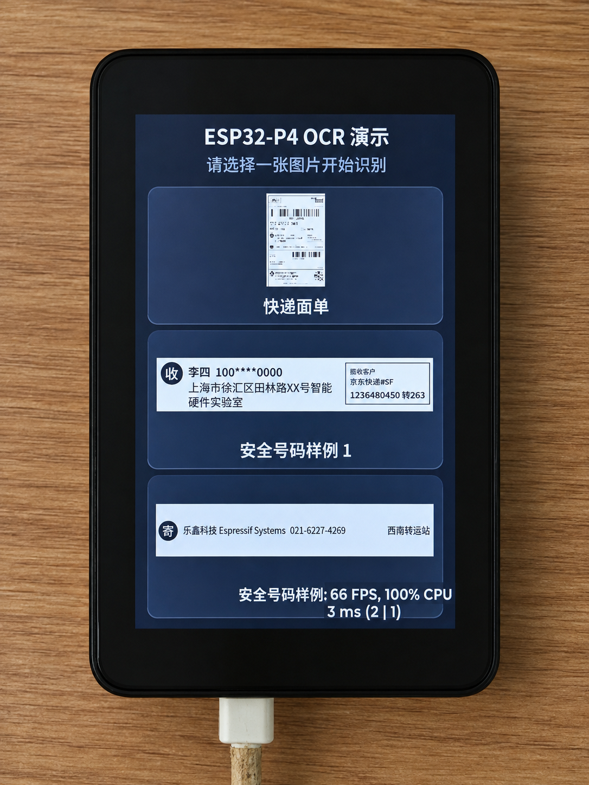
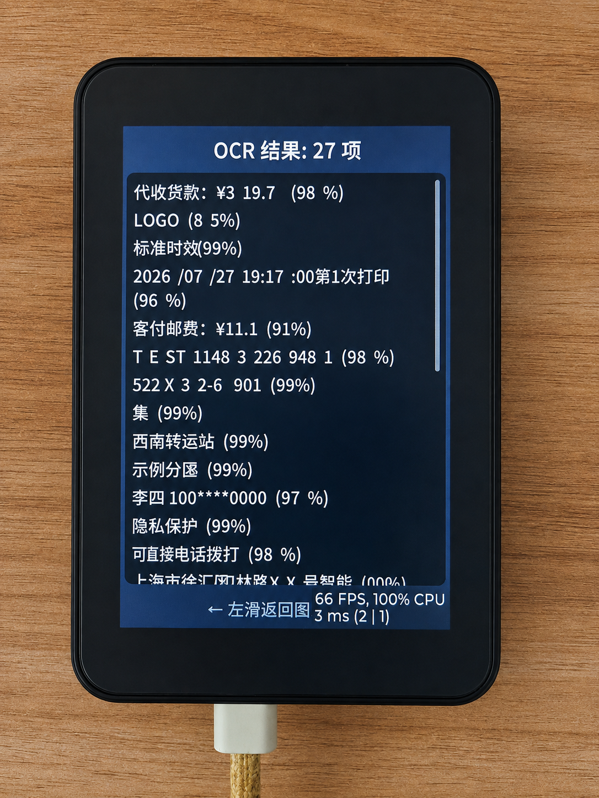
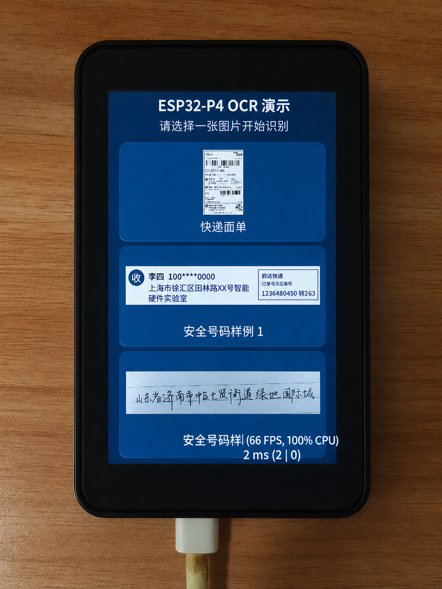
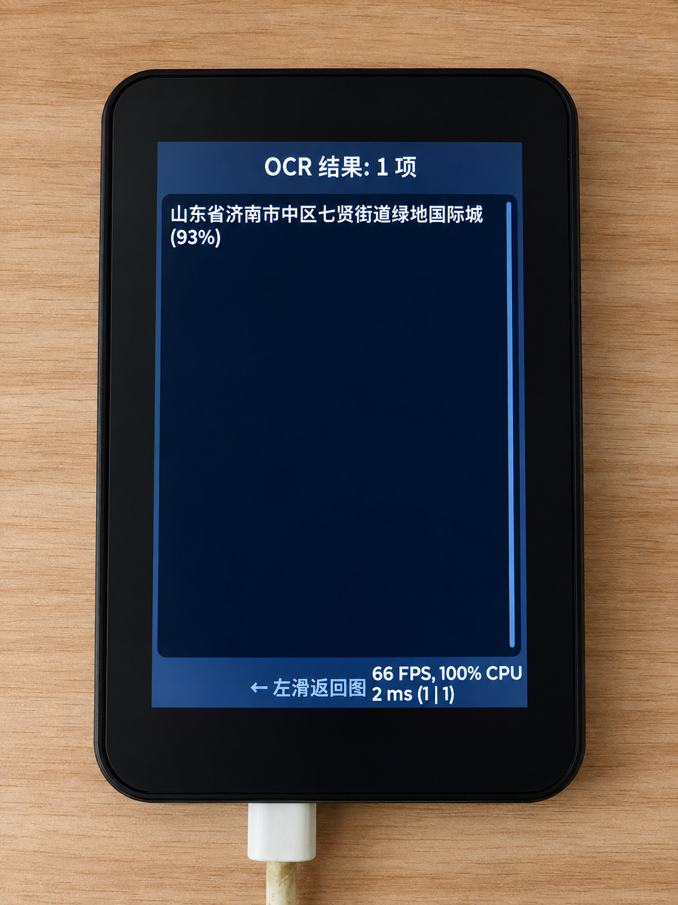

# ESP32-P4 快递面单 OCR

基于 [ESP-DL](https://github.com/espressif/esp-dl) **PP-OCRv6** 模型的端侧 OCR 识别系统。本项目复现了乐鑫 esp-dl 中的 OCR 示例，并将其移植到 **ESP32-P4 + Waveshare 3.5 寸触摸屏** 这一不同的硬件平台上。

> **与 esp-dl 原版的关键差异**：esp-dl 官方 OCR 示例默认运行在 ESP32-S3（如 ESP32-S3-EYE、Korvo-2）上。本项目在 ESP32-P4 上复现了整个 Pipeline——JPEG 解码 → PP-OCRv6 文字检测与识别 → LVGL 触摸屏结果展示，并针对 P4 的双核架构、大容量 Flash 和 PPA 硬件加速做了专项适配。

## 检测效果

| 快递面单 | 安全号码识别 |
|:---:|:---:|
|  |  |
|  |  |

## 硬件

| 模块 | 型号 |
|:---|:---|
| 主控 | [ESP32-P4](https://www.espressif.com/en/products/socs/esp32-p4)（双核 400 MHz, 32 MB PSRAM） |
| 开发板 | [Waveshare ESP32-P4-WIFI6-Touch-LCD-XC](https://www.waveshare.com/wiki/ESP32-P4-WIFI6-Touch-LCD-XC) |
| 屏幕 | 3.5 寸 320×480 电容触摸屏 |
| 存储 | 16 MB Flash（8 MB 应用 + 7 MB 字体分区) |

## OCR 模型

本项目使用 ESP-DL 提供的 **PP-OCRv6** 两阶段模型，由 `pp_ocr_v6` 组件封装：

| 阶段 | 模型 | 文件 | 输入规格 | 大小 |
|:---|:---|:---|:---|:---|
| 文字检测 | Det (S8) | `pp_ocr_v6_det_s8.espdl` | 整图 → 文本框坐标 | 649 KB |
| 文字识别 | Rec (S16) | `pp_ocr_v6_rec_s16.espdl` | 48×320 文本行切片 | 2.4 MB |

当前配置为 **SHORT 模式**，总模型体积约 **3 MB**。默认使用 INT16 精度以兼顾准确率与速度；另有 INT8 模型（1.2 MB，更快）和 LONG 模式（48×640，适配长文本行）可选。

## 模块划分

| 模块 | 文件 | 职责 |
|:---|:---|:---|
| **app_storage** | `app_storage.cpp/.hpp` | NVS 初始化、字体分区 mmap 挂载、资源读取 |
| **app_ui** | `app_ui.cpp/.hpp` | LVGL 界面：图片选择器、OCR 预览、结果卡片 |
| **ocr_pipeline** | `ocr_pipeline.cpp/.hpp` | JPEG 解码 → PP-OCRv6 推理 → 结果格式化 |
| **demo_images** | `demo_images.cpp/.hpp` | 内置演示图片注册与管理 |

## 关键技术点

- **双核分工**：Core 0 专跑 LVGL 渲染触摸交互，Core 1 专跑 OCR 推理，通过 FreeRTOS Queue 解耦
- **模型常驻**：`PPOCRV6` 实例在首次推理后保持加载，后续图片识别无需重新初始化
- **PPA 加速**：启用 ESP32-P4 的 PPA (Pixel Processing Accelerator) 硬件加速 LVGL 渲染
- **字体 Flash 映射**：约 3.9 MB 完整 CJK 字体通过 `esp_mmap_assets` 直接从 Flash 映射为只读内存，不占用 PSRAM；详见 [`docs/font_flash_mmap.md`](docs/font_flash_mmap.md)

## 许可

[Apache-2.0](LICENSE)

字体文件授权见：
- [`main/font_assets/LICENSE-DroidSansFallbackFull.txt`](main/font_assets/LICENSE-DroidSansFallbackFull.txt)
- [`main/font_assets/LICENSE-demo-fallback.txt`](main/font_assets/LICENSE-demo-fallback.txt)
